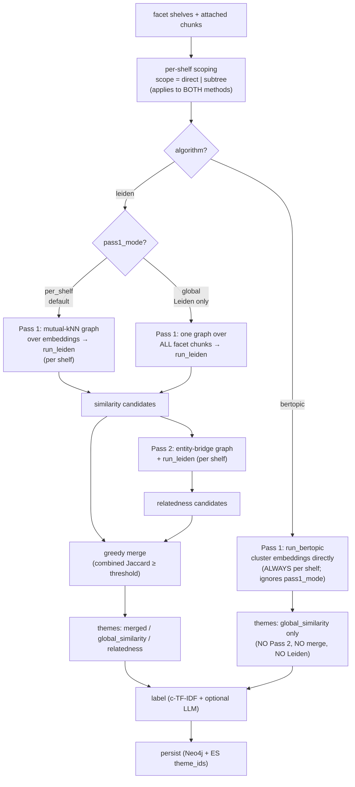
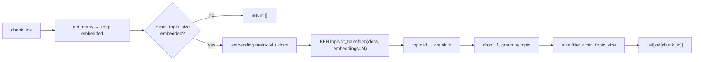
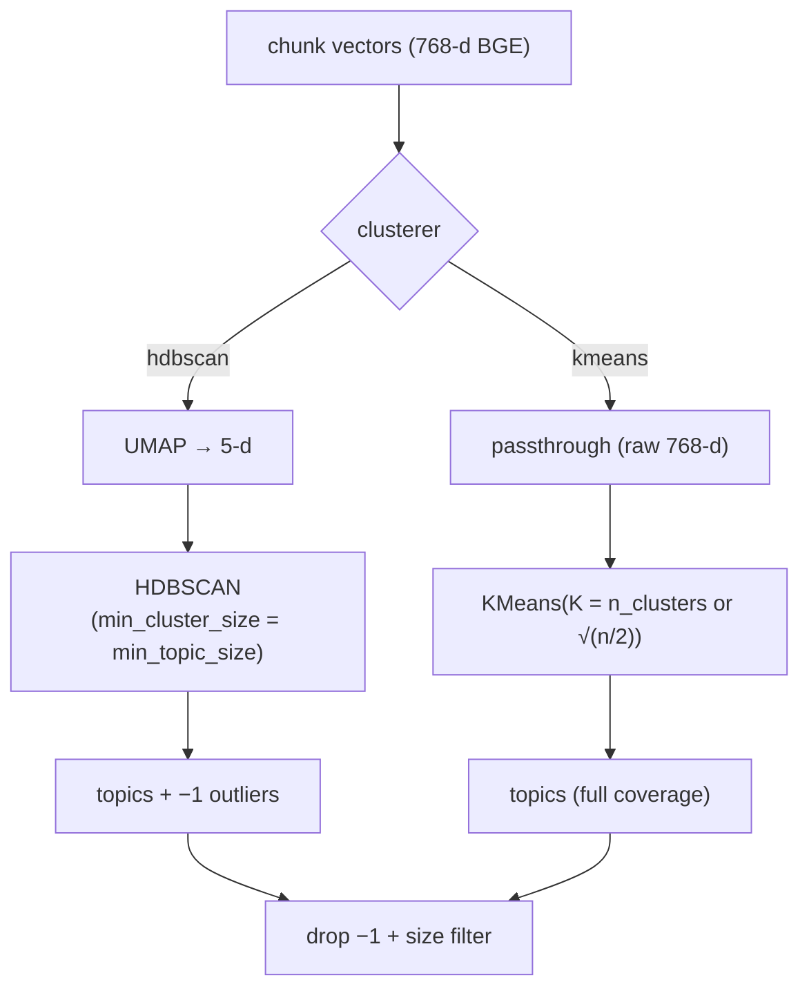
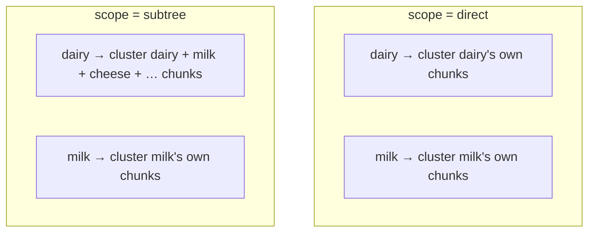
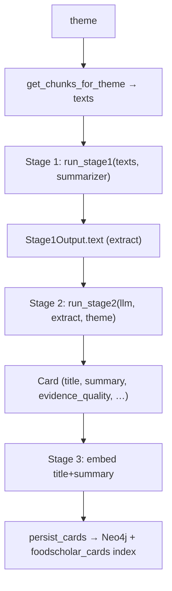
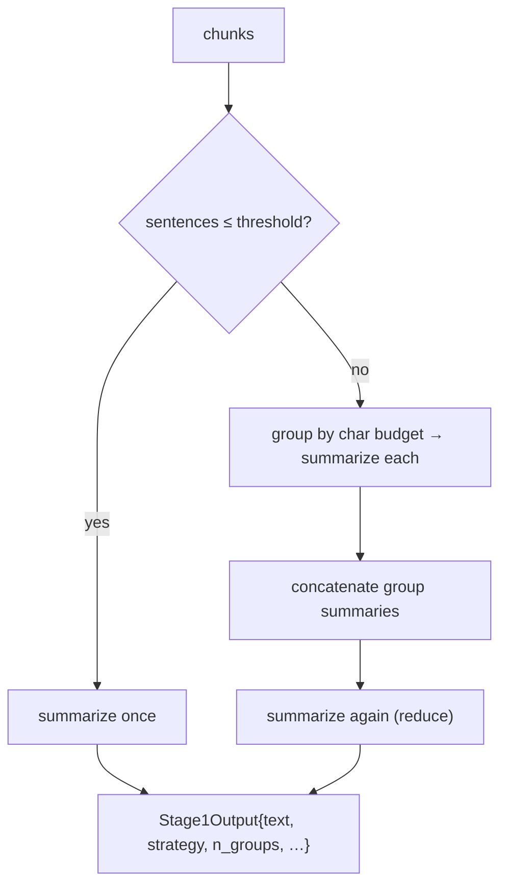
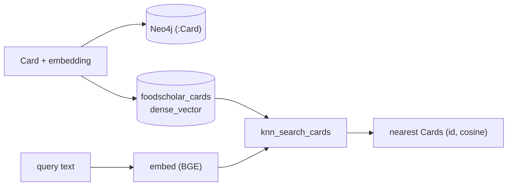

# Layer B (BERTopic) & Layer C — methods brief

A deep walk-through of the **BERTopic theme-discovery backend** for Layer B and the
**two-stage Layer C** card pipeline (extractive → LLM → embedded, searchable card). Written
for someone auditing output, tuning knobs, or extending the code. Companion to the concept
pages [`concepts/layer-b-themes.md`](concepts/layer-b-themes.md) and
[`concepts/layer-c-cards.md`](concepts/layer-c-cards.md), and to §7–§10 of
[`notebooks/graph_build.ipynb`](../notebooks/graph_build.ipynb).

---

## Part 1 — Layer B: BERTopic as a discovery backend

### 1.1 Where it plugs in

`config.layer_b.algorithm` selects the discovery backend, and the two backends run
**different pipelines** — this is the important part:

- **`leiden` (two-pass + merge).** Pass 1 is *Leiden over a similarity graph* (embedding
  coherence); Pass 2 is *Leiden over an entity-bridge graph* (FoodOn-entity relatedness);
  the two are then **merged** (greedy Jaccard). Both signals are graph/entity-flavoured, so
  when they agree on a topic the merge fuses them into a higher-confidence `merged` theme.
- **`bertopic` (single-pass).** Pass 1 clusters embeddings directly. **Pass 2 and the merge
  do NOT run.** BERTopic partitions a shelf on an embedding axis that is *orthogonal* to
  FoodOn entities, so a BERTopic topic and an entity-relatedness community almost never
  overlap — the merge produced **zero** merged themes and just concatenated two disjoint
  topic sets. Running Pass 2 there bought noise + double the compute for no synthesis, so
  bertopic mode skips it. Output is BERTopic topics only (`discovery_pass="global_similarity"`,
  `discovered_by="bertopic"`).

`leiden` stays the default; the production baseline (notebook §7/§9) is `bertopic`.



**Reading the diagram.** Both methods iterate shelves and honor `scope`. The fork is the
`algorithm`: **Leiden** runs two passes (similarity + entity relatedness) and **merges** them,
and its Pass 1 can optionally go `global`; **BERTopic** runs a single per-shelf pass and stops —
no Pass 2, no merge, and it never touches a Leiden code path (so the two never co-run). `pass1_mode`
is a Leiden-only knob and is ignored by BERTopic.

The integration contract is narrow: both backends produce **the same thing** — sets of
chunk-ids that become `ThemeCandidate`s. Leiden returns vertex-index sets from a graph;
BERTopic returns chunk-id groups from a direct clustering. Everything after candidate creation
is identical, which is why this is a low-risk swap rather than a Layer B rewrite.

| | Leiden | BERTopic |
|---|---|---|
| Input | similarity **graph** (mutual-kNN over cosine) | raw **embeddings** (no graph) |
| Mechanism | modularity community detection | UMAP+HDBSCAN, or passthrough+KMeans |
| Output | `list[set[int]]` (vertex indices) | `list[set[str]]` (chunk ids) |
| `discovered_by` | `"leiden"` | `"bertopic"` |
| Outliers | isolates fail the size filter | HDBSCAN `-1` bucket dropped; KMeans none |
| Determinism | `leiden.random_state` | `bertopic.random_state` (UMAP/KMeans) |

### 1.2 `run_bertopic` internals

`foodscholar/layer_b/bertopic_community.py :: run_bertopic(chunk_ids, chunk_store, cfg)`:

1. Fetch chunks; keep those with a cached embedding. If fewer than `min_topic_size` are
   embedded, return `[]` (clustering a tiny biased subsample is worse than nothing).
2. Build the `(ids, M, docs)` triple — id list, the `float32` embedding matrix `M`, and the
   chunk texts (BERTopic needs documents for its c-TF-IDF topic representation).
3. Fit BERTopic with the selected clusterer (below), passing `embeddings=M` so it clusters the
   **real BGE vectors**, not re-embedded text.
4. Map each document's topic id back to its chunk id; **drop topic `-1`** (HDBSCAN outliers);
   group by topic.
5. Return groups with `len ≥ min_topic_size`. A degenerate fit (too few separable points)
   is caught and returns `[]`.



### 1.3 The two clusterers

**`hdbscan` (default).** BERTopic as shipped: `UMAP(n_neighbors=15, n_components=5,
min_dist=0.0, metric="cosine")` → `HDBSCAN(min_cluster_size=min_topic_size, metric="euclidean",
cluster_selection_method="eom")`. Density-based: it *discovers* the topic count and assigns
ambiguous chunks to a `-1` outlier bucket (we drop them; they stay un-themed but searchable).
Reach for this when you don't want to pre-commit to a number of themes.

**`kmeans`.** A **passthrough** dimensionality reduction (cluster the raw 768-d BGE vectors
directly — UMAP on already-good embeddings can wash out structure) → `KMeans(n_clusters=K)`.
Full coverage (every chunk lands in a topic, no outliers) and a **predictable** count:
`K = n_clusters`, or auto `clamp(round(√(n/2)), 2, 12)` when `n_clusters is None`. Reach for
this when you want a controlled number of themes per shelf (e.g. to match a target density).



### 1.4 Scope — `direct` vs `subtree`

Both methods run per shelf (see §1.4a), and `layer_b.scope` decides which chunks each shelf
contributes to Pass 1 — it applies to **both Leiden and BERTopic**:

- **`direct`** (default) — the shelf's own directly-attached chunks only. Each chunk is clustered
  once, under its own shelf. Theme granularity matches the node.
- **`subtree`** — the shelf's chunks plus **every descendant's**. The builder precomputes a
  `parent → children` map for the facet once, then unions descendant chunk-ids per shelf via an
  iterative DFS. Inner nodes get broad roll-up themes; the same chunk participates in every
  ancestor's run (intentional — a "dairy" theme should see milk and cheese chunks).

> **Config note.** `layer_b.scope` is the single source of truth and governs both methods.
> `bertopic.scope` is a **deprecated back-compat alias**: it only takes effect for the BERTopic
> path when set to a non-default value, in which case it overrides `layer_b.scope` for BERTopic
> only. Resolution lives in `LayerBConfig.resolved_scope()`. New configs should set `layer_b.scope`.

#### 1.4a Per-shelf vs global — the `pass1_mode` axis

`pass1_mode` is **orthogonal to `algorithm`** and is a **Leiden-only** axis:

- **`per_shelf`** (production default) — a separate Pass-1 run per shelf. Every Pass-1 theme is
  single-shelf. Both methods run this way.
- **`global`** (experimental, **Leiden only**) — one similarity graph over all of a facet's
  attached chunks, finding cross-shelf bridges. **BERTopic has no global path**: it is inherently
  per-shelf. If a config sets `algorithm="bertopic"` + `pass1_mode="global"`, BERTopic **ignores**
  `pass1_mode` (running per-shelf) and logs a one-line notice — it never falls through to Leiden.



The `subtree` gate uses the **scoped** chunk count against `min_chunks_per_shelf`, so an inner
node sparse on direct chunks can still qualify on its branch total.

### 1.5 Tuning matrix

| Knob | Default | When to change |
|---|---|---|
| `layer_b.algorithm` | `leiden` | `bertopic` to use embedding-direct discovery |
| `layer_b.scope` | `direct` | `subtree` for branch-level roll-up themes (both methods) |
| `layer_b.pass1_mode` | `per_shelf` | `global` for cross-shelf bridge themes (**Leiden only**; ignored by BERTopic) |
| `bertopic.scope` | `direct` | *(deprecated alias of `layer_b.scope` — prefer the shared knob)* |
| `bertopic.clusterer` | `hdbscan` | `kmeans` for full coverage + controlled count |
| `bertopic.min_topic_size` | `15` | lower → more, smaller themes (biggest lever) |
| `bertopic.n_clusters` | `None` | KMeans only; pin to force a count |
| `bertopic.random_state` | `42` | change only to probe run-to-run stability |

```{admonition} Leiden is not abandoned
Switching `algorithm` is non-destructive — Leiden's graph builders, `run_leiden`, and all its
config live on untouched. You can A/B the two backends by toggling one field and rebuilding.
```

---

## Part 2 — Layer C: extractive → LLM → embedded card

### 2.1 The pipeline

One `Card` per Layer B theme. The expensive part (reading hundreds of chunks) is done by a
**free extractive** pass; the LLM only ever sees the small extract.



### 2.2 Stage 1 — extractive, behind one interface

Every method implements `BaseSummarizer.summarize(chunks: list[str]) -> str`, built from a
name→factory **registry** so the production builder and the benchmark harness share one source
of truth. Methods: `lexrank`, `lsa`, `luhn`, `textrank` (sumy) and `nltk_freq` (hand-rolled).

**Map-reduce.** Direct extractive ranking is `O(S²)` in sentence count. Above
`map_reduce_threshold` sentences (400), Stage 1 partitions chunks into `group_char_budget`
(20 000 char) groups, summarizes each, then summarizes the concatenation — bounding the matrix
while dropping nothing.



**The sentence splitter** is load-bearing. Real corpora carry markdown tables; a naïve
`.!?` split makes one table a single multi-KB "sentence", so size-bounded methods emit table
walls. The splitter excises pipe-delimited runs, drops non-prose fragments (mostly
digits/symbols), and clamps pseudo-sentences (>2000 chars). This was surfaced by the benchmark:
`luhn`/`textrank`/`nltk_freq` dumped ~17 KB of tables until the fix; `lexrank`/`lsa` looked
clean because they rank prose above tables.

### 2.3 Benchmark — choosing the method

`fs.benchmark_layer_c(facet, themes=N)` runs **all** methods over the largest themes, read-only
(no LLM, no persistence), emitting per-method metrics for side-by-side comparison:

```json
{"method": "lexrank", "summary": "…", "input_chunks": 180,
 "input_chars": 150781, "execution_time_ms": 21731, "summary_length_chars": 1003}
```

On a real 180-chunk dairy theme: **LexRank** and **LSA** produced clean ~1 KB prose extracts
with real claims; the others (pre-splitter-fix) produced table dumps. Conclusion baked into the
default: **`stage1_method = "lexrank"`**.

### 2.4 Stage 2 — LLM refinement

The extract + theme label/keywords → `fs.llm.generate_json(prompt, schema)` →
`title, summary, tip, evidence_quality, controversy_note, confidence_note`, mapped onto the
`Card`. Default model **`llama-3.1-8b-instant`** (Groq) — cheap and fast; the cards are
building-block summaries, not citation-precise documents.

`cited_chunk_ids` is **theme-level** (the chunks that fed Stage 1) — the LLM never sees chunks
individually, so this is provenance, not per-sentence grounding. `grounding_check="strict"`
guards summary non-emptiness and `≤ max_summary_chars`; `safety_flagged` is set when the
theme's facet is in `safety_sensitive_facets`.

```{admonition} Cost shape
Stage 2 is one LLM call per theme over a ~1–2 KB extract — not per chunk, not over 150 KB.
For a facet with a few hundred themes that's a few hundred small 8B calls.
```

### 2.5 Stage 3 — embed + dual-store + search

Each card's `title + summary` is embedded (the same BGE embedder as chunks, 768-d) and written
to **both** stores:

- **Neo4j** `(:Card)` node — graph lookup (`fs.graph.theme(id).card()`), as before.
- **Elastic `foodscholar_cards`** — a dedicated `dense_vector(768, hnsw, cosine)` index, a
  sibling to the chunk index, with the same ES-9 `_source`-vector-stripping workaround (read the
  vector back via the fields API). This is what makes cards **vector-searchable**.



`fs.search_cards(text, k)` = embed → `knn_search_cards` → fetch `Card`s. It's a thin retrieval
helper; `fs.query()` (answer synthesis) remains deferred, but Stage 3 provides the store it will
build on.

### 2.6 Layer C config matrix

| Knob | Default | Meaning |
|---|---|---|
| `stage1_method` | `lexrank` | extractive method (benchmark winner) |
| `stage1_sentences` | `8` | sentences kept per extractive pass |
| `map_reduce_threshold` | `400` | sentence count above which map-reduce kicks in |
| `group_char_budget` | `20000` | chars per map group |
| `max_summary_chars` | `4000` | strict-grounding length cap |
| `llm_model` | `llama-3.1-8b-instant` | Stage-2 model (+ stamped on the card) |
| `grounding_check` | `strict` | `strict` \| `lenient` \| `off` |
| `safety_sensitive_facets` | `[allergies]` | facets whose cards get `safety_flagged` |
| `benchmark_out_dir` | `data/layer_c_bench` | where the harness writes JSON |

---

## Running the full pipeline

```python
fs = FoodScholar.from_config("config.example.yaml")   # ES + Neo4j + cards index
fs.build()           # embed → entities → layer A → attach → layer B → layer C
# or step-by-step; Layer B honors layer_b.algorithm, Layer C uses stage1_method + llm_model
fs.search_cards("calcium and vitamin D for bone health", k=5)
```

The tuned baseline (notebook §7/§9): Layer B `algorithm="bertopic"` (`scope="direct"`,
`clusterer="hdbscan"`), Layer C `stage1_method="lexrank"` with `llama-3.1-8b-instant`.
