# FoodScholar Architecture Talk — Brief for Cowork

> **For Cowork-Claude:** This is a brief, not the deck. Read it end-to-end, then produce a click-through slide deck artifact (HTML/React, ~10 slides, 16:9, dark background, monospace headings). The brief is organized one section per slide. Speaker notes belong under each slide. Use the embedded Mermaid diagrams verbatim (don't restyle).

## Talk metadata

- **Speaker:** Dimitris (project lead, foodscholar-lib)
- **Audience:** ML/AI engineers — familiar with embeddings, vector DBs, graph databases, LLMs, RAG. Don't define `kNN`, `cosine`, `Leiden`, `ontology`, `HNSW`.
- **Length:** 10–15 minutes, ~10 slides + 1 title slide.
- **Goal:** Explain the architecture of FoodScholar, the design choices behind it, and why the choices matter. NOT a demo, NOT a roadmap pitch.
- **Tone:** Technical, direct, slightly self-critical about what went wrong. ML engineers respect honesty about failure modes.
- **Visual style:** Dark theme (e.g., `#0d1117` bg, `#c9d1d9` text), monospace for code/IDs (e.g. JetBrains Mono), proportional sans for prose (e.g. Inter). Diagrams: white-on-dark Mermaid with subtle accent color (cyan `#79c0ff` or amber `#f0883e` for highlighting active path).
- **Through-line:** A single query — *"Is olive oil good for cardiovascular disease?"* — appears on slides 1, 7. Use it to anchor every architectural concept.

---

## Slide 1 — Title

**Title:** FoodScholar
**Subtitle:** A 3-layer nutrition knowledge graph for grounded answers
**Footer:** *"Is olive oil good for cardiovascular disease?" — and how a system answers that without hallucinating*

**Speaker notes:**
> Frame the talk: we're going to explain *how* FoodScholar is built, using one realistic query as the through-line. By the end, you'll know what every architectural piece is doing when that query is answered.

---

## Slide 2 — The problem

**Title:** Why naive RAG over nutrition literature fails

**Body (3 bullets, no sub-bullets):**

- **No shared vocabulary.** Textbooks say "yogurt", "Greek yogurt", "fermented dairy", "FOODON:00003193" — a chunk-level retrieval can't tell these refer to overlapping concepts.
- **No navigation structure.** A user asking about "olive oil" should see chunks about Mediterranean diet, monounsaturated fats, and cardiovascular health — but generic kNN returns near-duplicates from the same paragraph.
- **No evidence quality signal.** Modern textbooks, popular guides, and PubMed reviews all live in the same vector space — retrieval has no way to prefer one.

**Speaker notes:**
> The motivating insight: in a domain with a real ontology (FoodOn for foods, MONDO for diseases, CHEBI for chemistry), we should *use* the ontology as scaffolding rather than relying on the model to rediscover relationships from raw text.

---

## Slide 3 — System topology

**Title:** Three layers over two stores

**Visual:** Mermaid diagram, full-slide. Highlight active path for the trace query in cyan if rendering supports it.

```mermaid
flowchart TB
    subgraph Ingest[Ingestion]
      C[Corpus: textbooks, guides, PubMed] -->|chunker| K[Chunks]
      K -->|BGE-base 768d| E[Embeddings]
      K -->|GLiNER NER| M[Mentions]
      M -->|HNSW linker| L[Entity Links → FoodOn IDs]
    end

    subgraph LayerA[Layer A — Shelves]
      L -->|lift up FoodOn hierarchy| SA[Shelf nodes]
      SA -.via Attach.-> KAttached[Chunks ↔ shelves]
    end

    subgraph LayerB[Layer B — Themes]
      KAttached -->|Pass 1: kNN + Leiden| T1[Similarity communities]
      KAttached -->|Pass 2: entity bridges + Leiden| T2[Relatedness communities]
      T1 --> TM[Themes]
      T2 --> TM
    end

    subgraph LayerC[Layer C — Cards]
      TM -.LLM-summarized.-> CDS[Cards: title, summary, citations]
    end

    subgraph Storage[Storage]
      ES[(Elasticsearch<br/>BM25 + HNSW)]
      N4[(Neo4j<br/>graph)]
    end

    K --> ES
    E --> ES
    SA --> N4
    TM --> N4
    TM -.theme_ids denorm.-> ES
    SA -.shelf_ids denorm.-> ES

    style LayerA fill:#1f2937,stroke:#79c0ff
    style LayerB fill:#1f2937,stroke:#79c0ff
    style LayerC fill:#1f2937,stroke:#6e7681,stroke-dasharray:5
    style Storage fill:#0d1117,stroke:#30363d
```



**Speaker notes:**
> Every layer is built on top of the previous, and every layer is queryable on its own. Storage is split: Elasticsearch owns retrieval (BM25 + HNSW kNN, filterable by shelf and theme IDs); Neo4j owns navigation (the shelf hierarchy, theme membership, chunk attachments). The denormalization between them is enforced by audit invariants — we'll come back to that. Layer C is dashed because it's planned, not built.

---

## Slide 4 — Layer A: ontology-anchored shelves

**Title:** Layer A — anchoring chunks to FoodOn

**Body (left column, prose):**

FoodOn is a 39,278-term ontology of food products with a real hierarchy: `apple → fruit produce → Foods`. A chunk's GLiNER-extracted mentions are linked to FoodOn IDs by a dense HNSW retriever over the ontology embeddings. Then we **lift** each chunk's entity IDs up the hierarchy until they hit a shelf with enough support to keep (`min_support=25` chunks).

**Body (right column, real data from current run):**

```
chunks_total           13,344
shelves_total              232
shelves_foods              227
shelves_health               1   (others stubbed)

top 'foods' shelves:
  fruit produce              633 chunks
  fat                        585 direct + 283 lifted
  vegetable                  542
  cow milk                   522
  red meat (raw)             69 direct + 409 lifted
  fish species               396 direct + 75 lifted
```

**Speaker notes:**
> One non-obvious choice: a chunk can attach to multiple shelves (a chunk discussing "salmon with olive oil" attaches to both `salmon` and `olive oil` shelves). And shelves collapse if they don't meet `min_support`. The 227 surviving "foods" shelves out of 39k FoodOn terms is the result — only the ones with real chunk evidence in *this* corpus survive.

---

## Slide 5 — Layer B: themes in two passes

**Title:** Layer B — finding structure inside (and across) shelves

**Body (two columns):**

**Pass 1 — Similarity**
- Build mutual-kNN graph over chunk embeddings (768-d BGE-base, cosine)
- Run Leiden community detection
- Output: "things that *read* alike"
- Trade-off: surface form. Two chunks about saturated fat phrased differently may not link.

**Pass 2 — Relatedness**
- Build entity-bridge graph: edge weight = Σ over shared FoodOn IDs of `1/log(1+df(id))` (TF-IDF flavor — rare entities count more)
- Run Leiden
- Output: "things that *talk about* the same things"
- Trade-off: structural. Won't link chunks discussing the same idea via different entities.

**Merge step (greedy):**

Pair candidates with high `chunk_jaccard` AND `entity_jaccard`. Otherwise keep both as separate themes.

**Speaker notes:**
> The two passes catch different kinds of structure. Pass 1 finds passages with similar prose; Pass 2 finds passages anchored to the same ontology terms. The merged theme is the strongest signal. Real numbers from the last run: 471 similarity themes, 312 relatedness themes, 0 merges — which tells us the merge thresholds need tuning, and the two passes don't agree as often as the brief assumed. That's tuning, not architecture.

---

## Slide 6 — The cross-shelf insight (v1 → v2)

**Title:** Themes should be cross-shelf primitives

**Body (prose):**

v1 ran Layer B's two-pass clustering *inside each shelf*. That seemed natural — "find sub-topics within `fat`, within `cow milk`, …" — but it produces the wrong primitive:

A chunk attached to both `fat` and `cow milk` (discussing saturated fat in dairy) gets clustered **twice**, in two different shelves' Leiden runs. The resulting two themes have the same chunks but unrelated labels. They look like separate topics; they aren't.

**v2 fix (designed, plan written):**

- **Pass 1 goes global.** One Leiden over all attached chunks (~6,290 with HNSW kNN via ES). Themes are first-class cross-shelf objects. `shelf_ids` on a theme = union over its member chunks.
- **Pass 2 stays per-shelf.** Entity coherence is sharper inside a shelf — running it globally would let the FoodOn root `Foods` dominate.
- **Merge step** crosses one global similarity set against the union of per-shelf relatedness candidates.

**Visual (small, right side or bottom):**

```mermaid
flowchart LR
    A[Attached chunks<br/>~6,290] -->|kNN + Leiden ONCE| G[Global similarity themes]
    A -->|per-shelf Leiden| R[Per-shelf relatedness themes]
    G --> M{Merge}
    R --> M
    M --> TF[Themes<br/>shelf_ids = union]
    style G fill:#1f2937,stroke:#f0883e
    style M fill:#1f2937,stroke:#79c0ff
```



**Speaker notes:**
> This is the lesson on slide 6 of a 10-slide deck because it's the most important architectural decision I've gotten wrong and reversed. v1 was in the original brief; v2 is the plan written this week. The data model didn't need to change — `Theme.shelf_ids` was already `list[ShelfId]`. The brief just under-imagined how often a topic would span shelves. Mention that the plan doc is in `docs/superpowers/plans/`.

---

## Slide 7 — One query, the whole trace

**Title:** "Is olive oil good for cardiovascular disease?"

**Visual:** Numbered path overlaid on a simplified version of the slide 3 topology, with the active route highlighted.

**Body (numbered steps, displayed as a sequence):**

1. **Hybrid retrieval (Elasticsearch).**
   - BM25 over `text` field, `query="olive oil cardiovascular"`
   - kNN over `embedding`, query vector = `BGE_base("...")`
   - Reciprocal-rank fusion of the two
   - Filter: `shelf_ids ∋ ["foodon:olive_oil"]` (and optionally `health:cardiovascular`)
   - Returns top-k chunks
2. **Theme expansion (Neo4j → Elasticsearch).**
   - Take the returned chunks' `theme_ids`
   - For each theme, pull other chunks via the `THEME_OF` edge
   - Adds complementary evidence (Mediterranean diet patterns, MUFA biochemistry) that pure kNN missed because the *phrasing* was different
3. **Re-rank + present.**
   - Score combines retrieval score + theme membership weight + (planned) evidence-quality from Layer C
   - Output: a small set of chunks with full provenance — source doc, section, FoodOn IDs, theme labels — ready for an LLM to ground its answer on

**Speaker notes:**
> The point of all the structure is on this slide. Pure kNN gives you near-duplicates. Pure BM25 misses paraphrase. Filtering by shelf gives you scope. Hopping via theme membership gives you the *complementary* evidence — chunks that share a topic but not surface form. The provenance trail (chunk → shelf → theme → source doc) is what makes a downstream LLM auditable.

---

## Slide 8 — Two stores, one truth

**Title:** Why Elasticsearch *and* Neo4j

**Body (two columns):**

**Elasticsearch handles:**
- BM25 keyword retrieval
- HNSW kNN (768-d dense_vector, cosine)
- Hybrid via RRF
- Filter by `shelf_ids` / `theme_ids` keyword arrays
- One round-trip per query

**Neo4j handles:**
- `(:Shelf)-[:PARENT_OF]->(:Shelf)` hierarchy
- `(:Chunk)-[:ATTACHED_TO]->(:Shelf)`
- `(:Chunk)-[:THEME_OF {primary, weight}]->(:Theme)`
- Graph traversals (theme expansion, shelf walks)

**The lockstep:**

A chunk's `shelf_ids` and `theme_ids` are denormalized to ES so retrieval can filter without round-tripping to Neo4j. The two stores can drift, so an audit runs cross-store invariants:

```
[PASS CRITICAL] shelf_ids (Elastic) ↔ ATTACHED_TO (Neo4j) parity — metric=1.0
[PASS CRITICAL] foodon_ids (Elastic) ↔ MENTIONS (Neo4j) exact match — metric=1.0
[PASS CRITICAL] cycles in PARENT_OF — metric=0
```

**Speaker notes:**
> A pure Neo4j system can't do good retrieval; a pure Elasticsearch system can't do graph traversal cheaply. So we pay the cost of two stores and a denormalization, and we pay the cost of audit invariants to catch drift. The audit runs after every Layer A or Layer B pipeline run.

---

## Slide 9 — What we learned (war stories)

**Title:** Three things that broke (and what they taught us)

**Body (three cards, equal weight):**

**1. ES 9.4 strips `dense_vector` from `_source`**

The HNSW vector is *indexed* (kNN works) but absent from `_source`. So `_mget` round-trips `Chunk` objects with `embedding=None`. The mapping looked correct; the data was wrong. Symptom: Layer B reported `0/N chunks have embeddings` on every shelf, even after a successful embed run with `embedding_model` set on every doc.

*Fix:* read via the `fields` API and merge back. *Lesson:* mapping correctness ≠ source correctness on ES 9.x. Always validate a read round-trip, not just the index.

**2. OCR junk dominated TF-IDF**

Textbook PDFs encoded bullets as `/H18567` (font-PUA glyph). The extractor passed the literal through. ~8% of the corpus carried it. c-TF-IDF for theme labels found it discriminative — themes got labeled `"h18567"`.

*Fix:* clean at ingestion. *Lesson:* downstream IR is only as clean as the ingest layer; the pipeline that converts PDFs is part of the model.

**3. The mock LLM was the default**

`FoodScholar.in_memory()` instantiates a mock LLM that returns `"Mock answer citing [CHUNK]."` for every call. Every theme label was that string. The Groq client was being built in a separate cell that didn't run before `build_layer_b`.

*Fix:* wire the LLM into `fs` at construction, not via post-hoc swap. *Lesson:* defaults that produce *plausible-looking* output are worse than defaults that fail loud.

**Speaker notes:**
> All three of these were caught by running the pipeline end-to-end on real data, not by unit tests. Unit tests verified each layer in isolation. The bugs lived in the *boundaries* — ES↔pydantic, OCR↔TF-IDF, facade↔LLM. The takeaway for layered systems: invest in cross-layer audits and end-to-end smoke tests, not just per-module coverage.

---

## Slide 10 — What's next

**Title:** Roadmap

**Body (four bullets, sized to fit):**

- **Cross-shelf themes v2** — global Pass 1 + per-shelf Pass 2 hybrid. Designed and planned. Replaces the per-shelf v1 the day after this talk.
- **Layer C cards** — LLM-generated summaries per theme. Each card carries: title, 3-sentence summary, evidence-quality label, cited `chunk_ids`. Cards are first-class queryable nodes alongside themes.
- **Eval harness** — a held-out set of natural-language queries with expert-graded answer sets. Today we have audit invariants (structural) but no semantic eval (does retrieval actually return useful chunks?).
- **Retrieval API** — productionize the hybrid search + theme-expansion flow from slide 7 behind a stable HTTP API. Until then, it lives in the facade and the notebook.

**Speaker notes:**
> The order matters. v2 cross-shelf themes ship first because they change the shape of the data downstream consumers see. Cards come next because they're the first user-facing artifact. Eval comes third because we need a baseline before tuning anything (per-shelf vs cross-shelf, merge thresholds, retrieval k). The API is last because there's no point shipping an API for a pipeline whose semantics are still being tuned.

---

## Visual & rendering instructions for Cowork-Claude

- **Slide format:** Click-through deck artifact. React component if Cowork supports it, otherwise self-contained HTML with arrow-key navigation and `?slide=N` deep links.
- **Theme:** Dark (`#0d1117` bg, `#c9d1d9` body, `#79c0ff` accent for links and highlights, `#f0883e` for "this is the important part" emphasis). Monospace for code/IDs (`text` class for prose, `mono` class for IDs like `FOODON:00003193`, `chunk_id`, `shelf_ids`).
- **Mermaid diagrams:** Render inline as SVG with the same dark theme (set `theme: dark` and `themeVariables.primaryColor: #1f2937` in the Mermaid init).
- **Code/data blocks:** Treat the audit-output blocks (slides 4, 8) as styled `<pre>` with subtle border, monospace, slight indent.
- **Speaker notes:** Put them in the artifact's notes panel if Cowork supports it; otherwise place collapsed under each slide as a `<details>`.
- **Footer:** Slide number + slide title + ⌘/Ctrl+→ hint on first load.
- **Don't add slides** I didn't specify. Don't add a "Thank you" slide; ML engineers find them embarrassing. End on slide 10.

## Source material — what to draw from if you need more detail

Cowork-Claude won't have direct file access. Everything you need is in this brief. If a section feels thin, prefer to keep it terse over inventing detail — Dimitris will fill in verbally.

The numbers on slide 4 (`chunks_total 13344`, `fruit produce 633`, etc.) are from a real audit output captured 2026-05-26. The `0 merges` number on slide 5 is from the same run. The three war stories on slide 9 are real incidents from this week.

---

## What is intentionally NOT in this deck

- A live demo (too fragile on a projector)
- The plan-doc detail for cross-shelf v2 (slide 6 is enough; doc is `docs/superpowers/plans/2026-05-27-cross-shelf-themes.md` if anyone asks)
- Embedding model rationale (BGE-base vs SPECTER2 vs OpenAI) — would be a different talk
- FoodOn details beyond "39k food terms, hierarchical" — domain detail, not architecture
- A "Thank you" or "Questions?" slide
