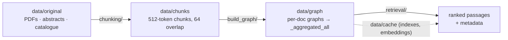

# graph_code — passage-aware knowledge graphs for WiseFood / FoodScholar

Turns nutrition **guides, textbooks and journal abstracts** into a passage-aware
knowledge graph, and answers questions over it with hybrid retrieval: text similarity
(0.3) + mean triplet similarity (0.3) + Personalized PageRank on the unified k-hop
subgraph (0.4). Every triplet keeps the passage(s) it was extracted from.



## Folders

| Folder | What it does |
|---|---|
| [`chunking/`](chunking/README.md) | PDFs → chunk CSVs (Docling HybridChunker + sliding 512/64 window, chapter-aware); abstracts split and semantically clustered. |
| [`build_graph/`](build_graph/README.md) | Chunk CSVs → passage-aware `ExtendedGraph`s (LLM extraction → aggregation → semhash dedup) and the GraphML/CSV/JSON exports. |
| [`kggen_extended/`](kggen_extended/README.md) | The local library extending KGGen with passage provenance (`ExtendedGraph`, `ExtendedKGGen`, `DeduplicateMethod`, `export_*`). |
| [`retrieval/`](retrieval/README.md) | Hybrid retrieval over the aggregated graph, metadata-only accessors and a CLI. |
| [`ner-nel/`](ner-nel/README.md) | NER + FoodOn entity-linking experiments (GLiNER / GLiNER2, SapBERT, BioLORD, SciFoodNER, FoodSEM). |
| [`utils/`](utils/README.md) | Source-catalogue handling and LLM-based PDF page triage (produces the filtered-page manifests). |
| [`data/`](data/README.md) | Inputs, chunk corpora, graphs and caches (~3.6 GB, see its README for the layout). |

## Environment

Developed against the conda environment **`python3.12_venv`** (Python 3.12):

```bash
conda activate python3.12_venv
pip install -r requirements.txt        # exact versions of this env, see the file header
```

[`requirements.txt`](requirements.txt) covers every third-party import of all `.py` files
and notebooks in this directory; [`ner-nel/requirements.txt`](ner-nel/requirements.txt)
covers the NER/NEL experiments, and the SciFoodNER helper is meant to run in its own
dedicated `scifoodner` conda environment.

## Running the pipeline

```bash
# 1. PDFs → chunk corpora
cd chunking && jupyter lab            # run the guides / textbooks / abstracts notebooks

# 2. chunks → knowledge graphs
cd ../build_graph
./run_all_kggen.sh                    # guides + textbooks + grand total
./run_abstracts_clusters_kggen.sh --aggregate-all

# 3. questions → passages
cd ../retrieval
python run_retrieval.py "What is the relationship between salt consumption above 2 g NaCl/day and arterial blood pressure?"
```

## Notes

- `kggen_extended` and the `retrieval_core` / `run_retrieval` modules are **local**, not
  installed packages: they are imported from this directory (the scripts put
  `graph_code/` on `sys.path` themselves).
- Inputs and outputs are addressed relatively (`../data/...`), so run each notebook or
  runner from its own folder.
- `data/cache/` (~550 MB of indexes + embeddings) can be deleted at any time — retrieval
  rebuilds it, and the embeddings take a few minutes on GPU.
- Both `build_graph/` runners execute Python through
  `conda run --no-capture-output -n ${KGEN_CONDA_ENV:-python3.12_venv}`.
